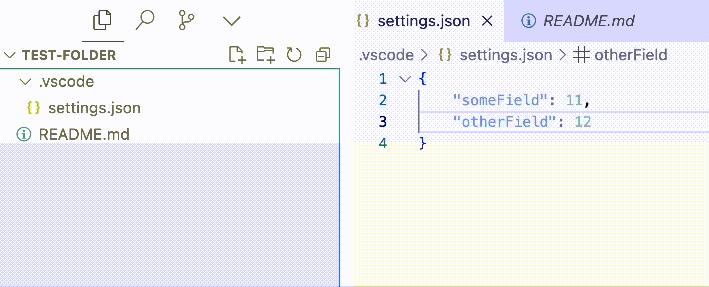

# Filesize Hover Explorer

See file sizes instantly by hovering over files in VS Code's Explorer. No more right-clicking or checking properties - just hover and know.

## Features

- Displays human-readable file sizes (B, KB, MB, GB) directly in the VS Code's File Explorer
- Works automatically - no configuration needed
- Super lightweight — no dependencies, just 50 lines of code



## Installation

### Marketplace

In VS Code, open the Command Palette (`Ctrl+Shift+P` or `Cmd+Shift+P`), type `Install Extensions` and hit Enter. In the search field, type `Filesize Hover Explorer`. Install the extension.

### Manual Installation

Download the latest `.vsix` from the [Releases page](https://github.com/cyberBabushkin/vscode-filesize-hover-explorer/releases). In VS Code, open the Command Palette (`Ctrl+Shift+P` or `Cmd+Shift+P`), type `Install from VSIX`, and select the downloaded file.

Or build it yourself:

```shell
npm install -g @vscode/vsce
git clone https://github.com/cyberBabushkin/vscode-filesize-hover-explorer
cd vscode-filesize-hover-explorer
npm ci
vsce package
```

It will generate the VSIX file in the source directory. The installation is the same as above.

## Known Issues

No known issues! Yet. But you can be the first! Report any issue on Github or create a pull request for changes.

## Support

⭐ Star | 🐛 Report Issues | EVM: `cyberbabushkin.eth`
